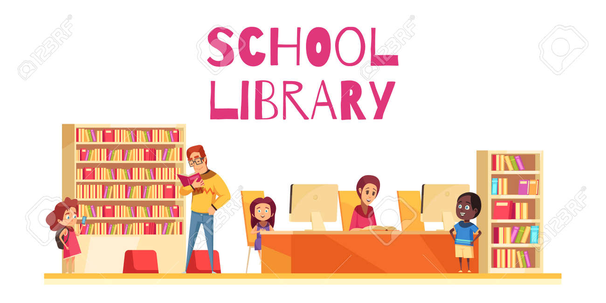

<a name="readme-top"></a>

<div align="center">
 
  
  <br/>

  <h3><b>SCHOOL LIBRARY</b></h3>

</div>


# 📗 Table of Contents

- [📖 About the Project](#about-project)
  - [🛠 Built With](#built-with)
    - [Tech Stack](#tech-stack)
    - [Key Features](#key-features)
  - [🚀 Live Demo](#live-demo)
- [💻 Getting Started](#getting-started)
  - [Setup](#setup)
  - [Prerequisites](#prerequisites)
  - [Install](#install)
  - [Usage](#usage)
  - [Run tests](#run-tests)
  - [Deployment](#triangular_flag_on_post-deployment)
- [👥 Authors](#authors)
- [🔭 Future Features](#future-features)
- [🤝 Contributing](#contributing)
- [⭐️ Show your support](#support)
- [🙏 Acknowledgements](#acknowledgements)
- [❓ FAQ](#faq)
- [📝 License](#license)

# 📖 [SCHOOL LIBRARY] <a name="about-project"></a>

**[SCHOOL LIBRARY]**  is a tool to record what books are in the library and who borrows them. The app allows you to: Add new students or teachers. Add new books. Save records of who borrowed a given book and when. And all of this is built in a beautiful and well-organized way!

## 🛠 Built With <a name="built-with"></a>

1- RUBY<br>
2- Gitflow<br>
3- Rubocop

### Tech Stack <a name="tech-stack"></a>

<details>
  <summary>Client</summary>
  <ul>
    <li><a href="https://www.microverse.org/">Microverse</a></li>
  </ul>
</details>

<details>
<summary>Ruby</summary>
  <ul>
    <li><a href="https://www.ruby-lang.org/">Ruby</a></li>
  </ul>
</details>

### Key Features <a name="key-features"></a>

- **[Add person.rb]**
- **[Add student.rb]**
- **[Add teacher.rb]**

<p align="right">(<a href="#readme-top">back to top</a>)</p>

## 🚀 Live Demo <a name="live-demo"></a>

> Add a link to your deployed project.

- [Coming Soon...](https://github.com/JuanDBta/school-library-project)

<p align="right">(<a href="#readme-top">back to top</a>)</p>

## 💻 Getting Started <a name="getting-started"></a>

To get a local copy up and running, follow these steps.

### Prerequisites

In order to run this project you need:

Web Browser (Chrome recommended)<br>
Code editor (VS recommended)<br>
GitHub account<br>

### Setup

Clone this repository to your desired folder:

```sh
  cd my-folder
  git clone "https://github.com/JuanDBta/school-library-project.git"
```
### Deployment

You can deploy this project using:<br>[Coming Soon!!!](https://github.com/JuanDBta/school-library-project)

<p align="right">(<a href="#readme-top">back to top</a>)</p>

## 👥 Authors <a name="authors"></a>

👤 **Micronaut JUAN DAVID DIAZ**

- GitHub: [@JuanDBta](https://github.com/JuanDBta)
- Twitter: [@simplebetsas](https://twitter.com/simplebetsas)
- LinkedIn: [LinkedIn](https://linkedin.com/in/simplebet/)

<p align="right">(<a href="#readme-top">back to top</a>)</p>

## 🔭 Future Features <a name="future-features"></a>

- [ ] **[Use the "Decorator" design pattern]**
- [ ] **[Set up associations]**
- [ ] **[Add basic UI]**
- [ ] **[Refactor your code]**
- [ ] **[Preserve data]**
- [ ] **[Unit tests]**

<p align="right">(<a href="#readme-top">back to top</a>)</p>

## 🤝 Contributing <a name="contributing"></a>

Contributions, issues, and feature requests are welcome!

Feel free to check the [issues page](../../issues/).

<p align="right">(<a href="#readme-top">back to top</a>)</p>

## ⭐️ Show your support <a name="support"></a>

If you like this project, please give me a like, it doesn't cost you anything and it helps me a lot to keep working.

<p align="right">(<a href="#readme-top">back to top</a>)</p>

## 🙏 Acknowledgments <a name="acknowledgements"></a>

I would like to thank Bee in Student Success who is always avalaible to solve issues and Microverse for push us to work hard every day!

<p align="right">(<a href="#readme-top">back to top</a>)</p>

## ❓ FAQ <a name="faq"></a>

- **["How can I see more projects associated with this author?"]**

  - Check my [GitHub profile](https://github.com/JuanDBta)

- **[How can I contact the author of this project?]**

  - Check my [LinkedIn profile](https://linkedin.com/in/simplebet/) or email me at simplebetsas@gmail.com

<p align="right">(<a href="#readme-top">back to top</a>)</p>

## 📝 License <a name="license"></a>

This project is [MIT](./LICENSE) licensed.

<p align="right">(<a href="#readme-top">back to top</a>)</p>
 